# Proyecto Final: Pac-Man con Reinforcement Learning

## Índice

- [Proyecto Final: Pac-Man con Reinforcement Learning](#proyecto-final-pac-man-con-reinforcement-learning)
  - [Índice](#índice)
  - [Introducción](#introducción)
  - [Marco Teórico](#marco-teórico)
    - [Reinforcement Learning](#reinforcement-learning)
      - [Markov Decision Problem](#markov-decision-problem)
      - [Passive Reinforcement Learning](#passive-reinforcement-learning)
      - [Active Reinforcement Learning](#active-reinforcement-learning)
    - [Q-Learning](#q-learning)
      - [Justificación de la elección](#justificación-de-la-elección)
    - [Deep Q-Networks (DQN)](#deep-q-networks-dqn)
      - [Justificación de la elección](#justificación-de-la-elección-1)
    - [Proximal Policy Optimization (PPO)](#proximal-policy-optimization-ppo)
      - [Justificación de la elección](#justificación-de-la-elección-2)
    - [Ambientes ALE y Gymnasium](#ambientes-ale-y-gymnasium)
  - [Diseño Experimental](#diseño-experimental)
    - [Métricas utilizadas](#métricas-utilizadas)
      - [Métrica integradora (Fantasmas + Puntos grandes + Puntos chicos)](#métrica-integradora-fantasmas--puntos-grandes--puntos-chicos)
        - [Descripción](#descripción)
        - [Cálculo](#cálculo)
        - [Interpretación](#interpretación)
      - [Cantidad de puntos chicos ingeridos](#cantidad-de-puntos-chicos-ingeridos)
        - [Descripción](#descripción-1)
        - [Cálculo](#cálculo-1)
        - [Interpretación](#interpretación-1)
      - [Winrate](#winrate)
        - [Descripción](#descripción-2)
        - [Cálculo](#cálculo-2)
        - [Interpretación](#interpretación-2)
      - [Cantidad de fantasmas ingeridos](#cantidad-de-fantasmas-ingeridos)
        - [Descripción](#descripción-3)
        - [Cálculo](#cálculo-3)
        - [Interpretación](#interpretación-3)
      - [Cantidad de pasos dados](#cantidad-de-pasos-dados)
        - [Descripción](#descripción-4)
        - [Cálculo](#cálculo-4)
        - [Interpretación](#interpretación-4)
  - 
    - [Herramientas y entornos](#herramientas-y-entornos)
    - [Estrategia de entrenamiento](#estrategia-de-entrenamiento)
      - [Q-learning](#q-learning-1)
      - [DQN](#dqn)
      - [PPO](#ppo)
    - [Descripción de los experimentos](#descripción-de-los-experimentos)
    - [Resultados](#resultados)
      - [Random](#random)
      - [Q-learning](#q-learning-2)
      - [DQN](#dqn-1)
      - [PPO](#ppo-1)
  - [Análisis y Discusión de Resultados](#análisis-y-discusión-de-resultados)
  - [Conclusiones Finales](#conclusiones-finales)
  - [Bibliografía](#bibliografía)

---

## Introducción

El videojuego Pac-Man, lanzado en 1980, representa un entorno dinámico donde el agente Pac-Man debe moverse por un laberinto, recolectar puntos (pellets), evitar ser atrapado por enemigos (fantasmas) y aprovechar oportunidades especiales (recolectar power pellets y frutas). Resolver este entorno de forma automática implica enfrentar una serie de desafíos, como la toma de decisiones en tiempo real, la incertidumbre del comportamiento enemigo y la gestión eficiente de las vidas.

Los métodos tradicionales de programación de agentes para videojuegos requieren un conocimiento exhaustivo de reglas, comportamientos y planificación, lo que dificulta su escalabilidad o adaptabilidad. En cambio, Reinforcement Learning (RL), permite entrenar agentes que aprenden a través de la experiencia, recompensas y penalizaciones, sin necesidad de reglas predefinidas.

El uso de RL en Pac-Man resulta adecuado, ya que el entorno posee características típicas de los problemas de decisión secuencial: un espacio de estados observables, un conjunto de acciones discretas, y una retroalimentación en forma de recompensas. Esto habilita al agente a aprender políticas que maximicen la recompensa acumulada a largo plazo. Por lo tanto, este proyecto se centrará en aplicar y comparar diversos algoritmos de RL en el entorno Pac-Man. Se estudiarán estrategias como la solución aleatoria, Q-Learning, Deep Q-Networks (DQN) y Proximal Policy Optimization (PPO).

Finalmente, el informe está organizado de la siguiente manera: en el Marco Teórico se presentan los fundamentos de RL y los algoritmos a utilizar. Luego, en el Diseño Experimental, se detallan las métricas, herramientas y configuraciones empleadas. Y, en las secciones siguientes, se presentan los Resultados obtenidos, su Discusión y Análisis, y las Conclusiones, donde se resumen los hallazgos y posibles mejoras.

---

## Marco Teórico

### Reinforcement Learning

Reinforcement Learning es un paradigma del aprendizaje automático en el cual un agente aprende a tomar decisiones mediante la interacción con un entorno, recibiendo recompensas o penalizaciones por sus acciones. A diferencia del aprendizaje supervisado, en RL no se cuenta con ejemplos etiquetados de la acción correcta, sino que el agente debe descubrir, a través de la experiencia, una política óptima de comportamiento que le indique qué acción tomar en cada estado, para poder maximizar la recompensa acumulada a lo largo del tiempo. [8]

#### Markov Decision Problem

El RL se basa en el modelo de Procesos de Decisión de Markov (MDP), definidos por:

* Un conjunto de **estados** $S$
* Un conjunto de **acciones** $A$
* Un **modelo de transición** $P(s'|s,a)$: probabilidad de llegar a $s'$ desde $s$ al ejecutar $a$
* Una **función de recompensa** $R(s)$
* Un **factor de descuento** $\gamma \in [0,1]$, que pondera las recompensas futuras

#### Passive Reinforcement Learning

En este enfoque, el agente sigue una política fija $\pi$ y su tarea es **evaluar cuán buena es esa política**, es decir, aprender la utilidad $U^\pi(s)$ de cada estado bajo esa política. Se asume que el entorno es completamente observable, pero el modelo de transición y la función de recompensa son desconocidos. [8]

#### Active Reinforcement Learning

Este otro enfoque implica que el agente **debe aprender qué hacer**, es decir, su política no está dada. Debe explorar el entorno para conocer sus consecuencias y balancear **exploración vs explotación**. La primera consiste en explorar seleccionando diferentes acciones aleatoriamente, mientras que explotación se trata de elegir la mejor acción posible en cierto momento. Es importante equilibrar ambos, puesto que si explora mucho el agente puede nunca alcanzar un resultado óptimo y si siempre elige lo mejor (greedy), puede estancarse en un subóptimo, limitandose a "lo mejor conocido". [8]

---

### Q-Learning

El algoritmo Q-Learning permite aprender una política óptima sin modelo, actualizando la función de acción-valor $Q(s, a)$ directamente: [8]

$$
Q(s, a) \leftarrow Q(s, a) + \alpha (r + \gamma \max_{a'} Q(s', a') - Q(s, a))
$$

#### Justificación de la elección

Q-Learning tiene baja eficiencia en entornos complejos como Pac-Man ya que requiere estados discretos, pero su inclusión en el proyecto es una etapa fundamental para comprender los principios de Reinforcement Learning como también los conceptos de $Q(s, a)$, balance entre exploración y explotación y su actualización basada en la ecuación de Bellman. Además, es un buen algoritmo para poder realizar comparaciones luego con DQN y PPO, y notar las grandes diferencias de implementación y, obviamente, de resultados obtenidos.

### Deep Q-Networks (DQN)

Las Deep Q-Networks, resuelven la limitación de Q-Learning en espacios de estado grandes o continuos, donde una **red neuronal** se utiliza como aproximador de la función $Q(s, a)$. Esta red aprende a predecir los valores Q para cada acción a partir de la representación del estado, lo que permite manejar entornos con millones de estados. [2]

DQN introduce dos estrategias para estabilizar el entrenamiento:

- **Replay buffer:** Aquí DQN almacena experiencias y permite a los agentes recordar y reutilizar experiencias pasadas. La red se entrena utilizando mini-batches aleatorios de experiencias extraídas de este búfer, lo que rompe la correlación entre experiencias consecutivas y mejora la eficiencia en el uso de muestras. [2] [4]
- **Target network:** Se utiliza una copia fija de la red (que se actualiza con menor frecuencia que la red principal) para calcular los valores Q objetivo, evitando que se desestabilicen durante el aprendizaje. [2]

La red se entrena minimizando la diferencia entre las predicciones y los valores objetivo.

#### Justificación de la elección

DQN se eligió ya que resuelve la principal limitación de Q-learning, que es la imposibilidad de manejar espacios de estados grandes o continuos como los que presenta el entorno visual de Pac-Man, mediante el uso de redes convolucionales. Además, Pacman devuelve imágenes como observaciones y DQN es especialmente efectivo para procesarlas, esto lo hace una elección particularmente buena.

---

### Proximal Policy Optimization (PPO)

Proximal Policy Optimization (PPO) es un algoritmo de **policy-gradient** diseñado para entrenar agentes en entornos complejos y dinámicos. PPO mejora la estabilidad y eficiencia del aprendizaje sin requerir cálculos costosos. La idea principal es evitar que el agente cambie demasiado rápido su forma de actuar (o su política). Para eso, utiliza una estrategia especial que permite avanzar sin perder lo que ya se aprendió. A esto se le llama **optimización proximal**, ya que mantiene cada cambio “cerca” del anterior y lo hace utilizando una **Clipped Surrogate Function** que está específicamente diseñada para mantener las actualizaciones pequeñas y estables [6] [7]

En entornos visuales como Pac-Man, PPO (como también DQN) utiliza **redes neuronales convolucionales (CNN)** para procesar las imágenes del juego y extraer información relevante, como la posición de Pac-Man, los fantasmas y los puntos. Estas redes permiten interpretar píxeles como estados del entorno y tomar decisiones basadas en ellos, lo que hace que el agente pueda aprender directamente desde la imagen del juego, sin necesidad de reglas predefinidas. [9]

#### Justificación de la elección

PPO se eligió ya que a diferencia de los dos algoritmos anteriores, este representa los algoritmos de *policy gradient*, aprendendiendo directamente una política $\pi(a|s)$ sin necesidad de estimar funciones $Q$ y, también, es **on-policy**, lo que implica que aprende sobre la política actual del agente. Además, funciona bien con entornos donde las observaciones son imágenes, como es en este caso.

---

### Ambientes ALE y Gymnasium

El entorno utilizado para entrenar al agente es el de Pacman-v5 de la librería Gymnasium, que utiliza ALE (Arcade Learning Environment) como backend. Este entorno representa el juego original de Atari y proporciona imágenes RGB como observación (resolución de 210x160 píxeles) y un espacio de acciones discretas. [1]

Para poder aplicar RL, es necesario utilizar wrappers personalizados, como:

- Reducción de dimensiones y colores.

- Limitación del conjunto de acciones a solo las necesarias (LEFT, RIGHT, UP, DOWN).

- Modificación de recompensas al ejecutar acciones.

- Stack de frames para representar movimiento.

---

## Diseño Experimental

### Métricas utilizadas
Las métricas son importantes ya que permiten medir el desempeño de nuestras soluciones y posteriormente compararlas entre sí. Se tomaron en cuenta diferentes indicadores para tener en cuenta los diversos aspectos que presenta Pacman.

#### Métrica integradora (Fantasmas + Puntos grandes + Puntos chicos)
##### Descripción
La métrica integra la cantidad de fantasmas comidos y la cantidad de puntos grandes y puntos chicos ingeridos, ponderando cada uno de estos según su importancia. Es importante ya que estos 3 factores son los que más aportan al objetivo del proyecto, que el agente sea capaz de ganar una partida de Pacman. Otros aspectos no fueron tenidos en cuenta ya que no son verdaderamente relevantes para medir esto, por ejemplo, las frutas.
##### Cálculo
Para calcularla se le dio más importancia a comer fantasmas junto a los puntos grandes y un poco menos a los puntos chicos. La fórmula utilizada fue:  

$\text{Puntuación} = 5 \times (\text{fantasmas}) + 3 \times (\text{puntos grandes}) + 1 \times (\text{puntos chicos})$

##### Interpretación
Mientras mayor el resultado, mejor el desempeño en general del agente. Resultados muy bajos demuestran la baja ingestión de puntos y fantasmas, alejándolo del objetivo, ganar la partida.

--- 

#### Cantidad de puntos chicos ingeridos
##### Descripción
La métrica se trata de la cantidad de puntos chicos comidos por pacman. Es importante puesto que es la métrica más directa que brinda información acerca de cuán cerca estuvo el agente de ganar la partida, puesto que, el agente gana la partida cuando no queda ningún punto chico en el mapa.
##### Cálculo
Para calcularla se realiza la suma de todos los puntos recogidos por el agente.

##### Interpretación
Mientras mayor el resultado, más cerca de ganar la partida. Si el resultado supera los 126 puntos, significa que el agente ganó. Por otro lado, resultados muy bajos indican que el agente se encontraba lejos de completar exitosamente el nivel.

--- 
#### Winrate
##### Descripción
Se trata de la cantidad de veces que el agente ganó una partida sobre la cantidad de partidas que jugó.
##### Cálculo
Para calcularla se utiliza la siguiente fórmula:  
$\text{Winrate} = \frac{\text{cantidad de victorias}}{\text{episodios ejecutados}}$

##### Interpretación
Resultados cercanos a 1 indican que se ganó la mayoría de las veces. Sin embargo, si el resultado se acerca a 0, la cantidad de victorias fueron muy pocas.

--- 
#### Cantidad de fantasmas ingeridos
##### Descripción
Se trata de la cantidad de veces que el agente comió un fantasma. Es una métrica importante puesto que nos muestra que tan agresivo es nuestro agente. Si bien no aporta información acerca de cuán cerca estuvo de ganar la partida, puesto que se puede ganar sin comer ningún fantasma, es relevante ya que comer fantasmas facilita alcanzar la victoria al minimizar la cantidad de enemigos durante un cierto tiempo.
##### Cálculo
Para calcularla se realiza la suma de la cantidad de fantasmas comidos por el agente.

##### Interpretación
Resultados muy grandes indican una agresividad elevada mientras que resultados más bajos indican un comportamiento más pasivo. Esta métrica no sirve para evaluar el acercamiento a la victoria.

---
#### Cantidad de pasos dados
##### Descripción
Se trata de la cantidad de pasos que dió el agente hasta perder todas las vidas. Es importante ya que nos indica el nivel de supervivencia del agente, nuevamente, sobrevivir no está ligado a ganar, sin embargo, es relevante ya que muestra que el agente tiene la capacidad de evadir la muerte efectivamente. 
##### Cálculo
Para calcularla se realiza la suma de los pasos dados por el agente desde el comienzo del episodio hasta que el agente pierde todas sus vidas.

##### Interpretación
Resultados elevados indican que el agente aprendió efectivamente a sobrevivir una gran cantidad de tiempo y a evadir a los fantasmas correctamente. Por otro lado, resultados menores denotan falta de capacidad para evadir enemigos.

---
##
### Herramientas y entornos
Para el desarrollo del proyecto se utilizaron diversas herramientas con diferentes versiones. 
Se utilizó el lenguaje de programación **Python** en su versión 3.10.11.

Con respecto al entorno, se utilizó **ALE-py** [10] versión 0.8.1 junto a **Gymnasium** en su versión 0.29.1 y **AutoROM** en su versión 0.6.1. Específicamente se hizo uso de "Pacman-v5". Se investigó acerca de "MsPacman-v5" pero se seleccionó el primero debido a su simplicidad visual y técnica, pues este tenía menos acciones posibles y las características visuales eran menos complejas. Para el entrenamiento se utilizó el modo 0 y para las pruebas se utilizaron los modos 0, 2 y 5. El modo 2 enlentece a los fantasmas mientras que el modo 5 los acelera.

Se utilizaron las implementaciones de PPO y DQN de **Stable-baselines3** en su versión 2.6.0. Para poder realizar los entrenamientos con GPU se hizo uso del software **ROCm** en su versión 6.3 debido a la compatibilidad con tarjetas de video AMD.

Para el control de versiones y colaboración se utilizo **Git** y **Github**.

Por último, para realizar los gráficos se utilizo **Matplotlib**.  

---
### Estrategia de entrenamiento
Se realizaron los entrenamientos de los modelos de Q-learning, DQN, PPO. En los 3 casos se utilizaron diferentes configuraciones por lo que se presentarán en sus respectivas secciones. 

---

#### Q-learning  
--- 

#### DQN
Se realizaron diferentes pruebas para determinar las recompensas y los hiperparámetros definitivos [Ver resultados de pruebas](code/dqn/tests/README.md). Estos fueron:  

**Recompensas:**
- Puntos: 0.3 punto
- Puntos grandes: 0.4 puntos
- Muerte de fantasma: 1 punto
- Fruta: 0 puntos
- Muerte: -1 puntos
- Penalización por no obtener recompensa en 5 pasos: -0.05 puntos  

**Hiperparámetros:**
- learning_rate=5e-5 
- exploration_fraction=0.15
- exploration_final_eps=0.05,
- buffer_size= 200000
- batch_size = 32  

Para entrenar el modelo se utilizaron 12.000.000 de timesteps.

--- 

#### PPO
Se realizaron diferentes pruebas para determinar las recompensas y los hiperparámetros definitivos [Ver resultados de pruebas](code/ppo/tests/README.md).  Estos fueron:  

**Recompensas:**
- Puntos: 0.35 punto
- Puntos grandes: 0.4 puntos
- Muerte de fantasma: 1.1 punto
- Fruta: 0 puntos
- Muerte: -1 puntos
- Penalización por no obtener recompensa en 5 pasos: -0.05 puntos  

**Hiperparámetros:**
- n_steps=1536,
- batch_size=384,
- n_epochs=8,
- gamma=0.99,
- gae_lambda=0.9,
- clip_range=0.04,
- ent_coef=0.003,
- vf_coef=0.5,
- learning_rate=2.5e-4,
- max_grad_norm=0.5,

Para entrenar el modelo se utilizaron 12.000.000 de timesteps.  

--- 

### Descripción de los experimentos
Se realizaron 3 tipos de experimentos. Los mismos consistieron en la ejecución de los modelos en 3 variaciones del entorno. Esto se realizó de esta manera ya que de esta forma no solo se probaría en exactamente el mismo entorno que se usó para entrenar y los agentes verían características no vistas durante el entrenamiento. Gracias a esto, podemos analizar la capacidad de los mismos para generalizar y no limitamos el análisis al entorno que ya conocen.  

Para los experimentos se realizaron 100 ejecuciones por cada algoritmo (Random, Q-Learning, DQN, PPO) y por cada modo del entorno (0, 2 y 5) con la semilla "2025". El modo 0 del entorno consiste en mantener las velocidades de los fantasmas en los valores por defecto. Por otro lado, el modo 2 sería un "modo fácil", ya que los fantasmas se mueven más lentamente. Por último, el modo 5 sería el "modo difícil" debido a que los fantasmas son mas veloces. 

Con estas 100 ejecuciones de cada caso se obtuvieron las métricas mencionadas anteriormente y se analizarán en la siguiente sección. Particularmente, con estos indicadores se buscó evaluar que tan buenos fueron los modelos. Para ello, se tomó en cuenta el objetivo del proyecto, es decir, cuán cerca estuvieron de ganar. Sin embargo, también se midieron otros aspectos, por ejemplo, su capacidad de supervivencia, la cantidad de veces que se ganó o el nivel de agresividad mediante la ingestión de fantasmas.

--- 

### Resultados
Los resultados fueron obtenidos sobre 100 ejecuciones por cada combinación.  

#### Random

---
#### Q-learning

---
#### DQN  
**Tabla resumen de métricas obtenidas**

| Entorno               | Promedio métrica integradora | Promedio de puntos chicos ingeridos | Promedio de fantasmas ingeridos | Promedio de pasos dados | Winrate
|-----------------------|-----------------|-------|--------|--------|---------|
| Modo 0   | 161.54             | 124.5   | 4.96 | 1191.78 | 0.02 |
| Modo 2  | 143.92         | 118.17 | 2.81 | 1265.32 | 0.0 |
| Modo 5   | 153.71            | 122.92  | 3.74 | 1302.16 | 0.02 |  

**Resultados de métrica integradora en 100 episodios**  

  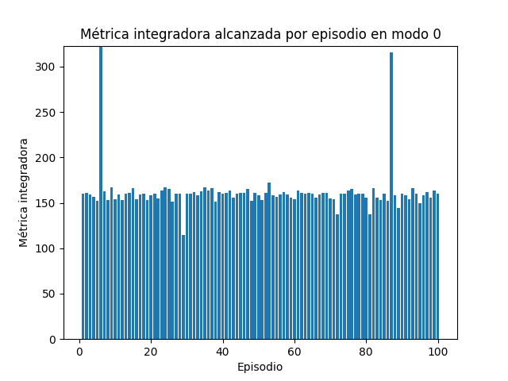
  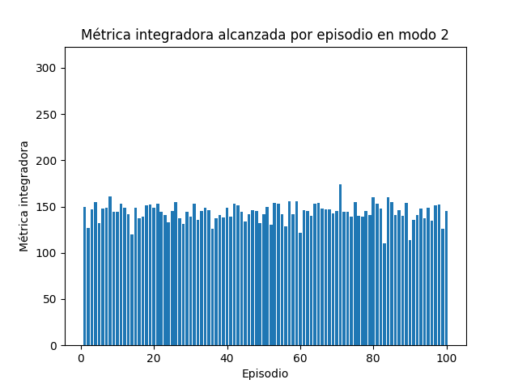
  

**Cantidad de puntos chicos ingeridos en 100 episodios**  

  
  
  

**Cantidad de pasos dados en 100 episodios**  

  
  
  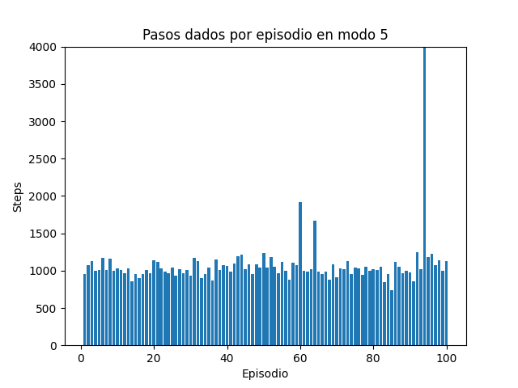

**Cantidad de fantasmas ingeridos en 100 episodios**  

  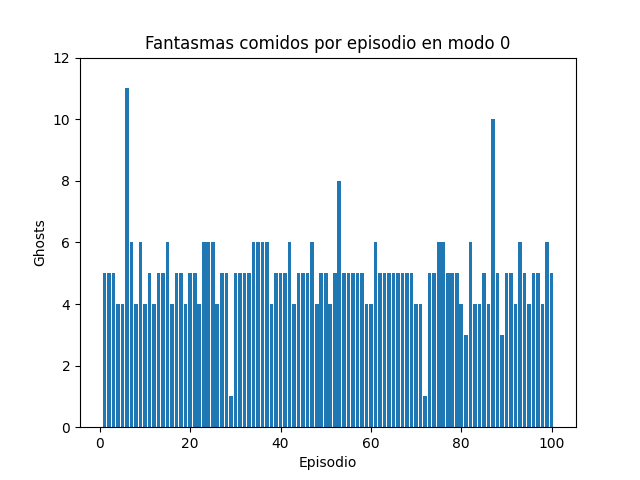
  
  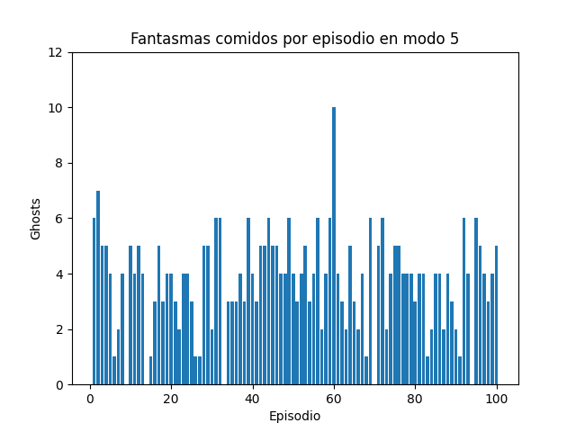

**Boxplots de métricas integradoras en 100 episodios**  

  
  
  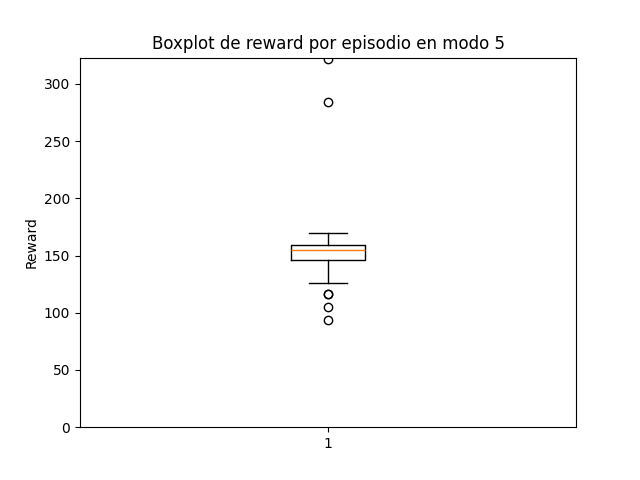

**Boxplots de puntos chicos ingeridos en 100 episodios**  

  
  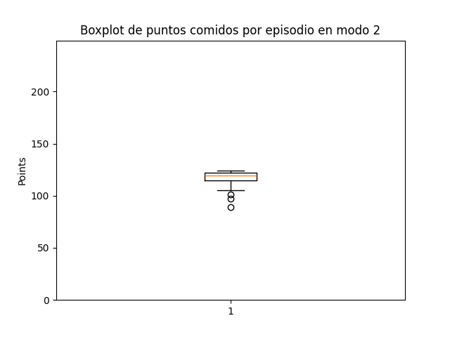
  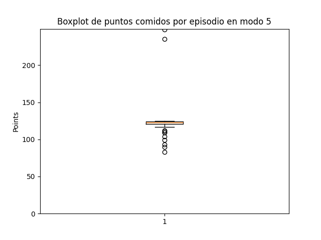

**Boxplots de pasos dados en 100 episodios**  

  
  
  

**Boxplots de fantasmas ingeridos en 100 episodios**  

  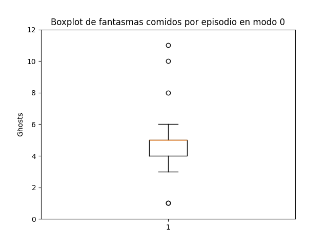
  
  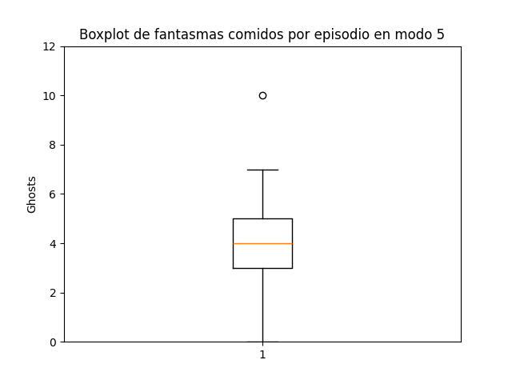

  

----

#### PPO
**Tabla resumen de métricas obtenidas**

| Entorno               | Promedio métrica integradora | Promedio de puntos chicos ingeridos | Promedio de fantasmas ingeridos | Promedio de pasos dados | Winrate
|-----------------------|-----------------|-------|--------|--------|---------|
| Modo 0   | 156.55             | 127.22   | 3.4 | 1302.78 | 0.03 |
| Modo 2  | 147.48         | 120.3 | 3.24 | 1400.26 | 0.01 |
| Modo 5   | 149.41            | 120.88  | 3.33 | 1148.24 | 0.00 |  

**Resultados de métrica integradora en 100 episodios**  

  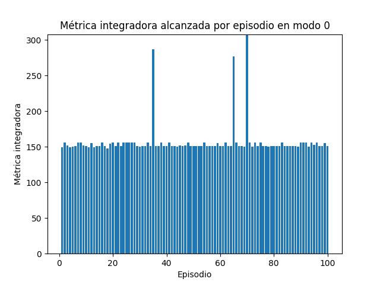
  
  

**Cantidad de puntos chicos ingeridos en 100 episodios**  

  
  
  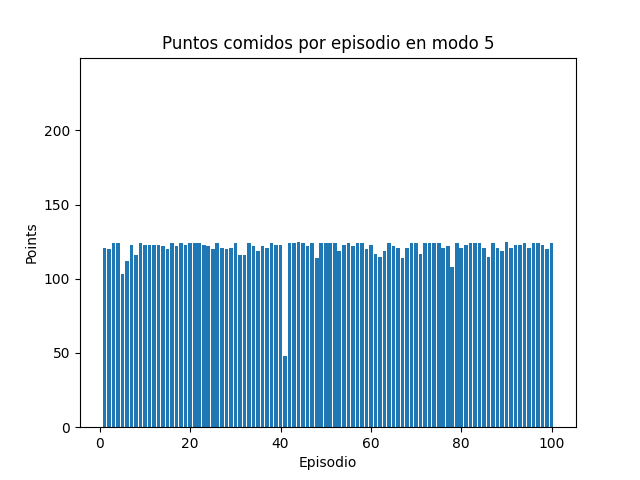

**Cantidad de pasos dados en 100 episodios**  

  
  
  

**Cantidad de fantasmas ingeridos en 100 episodios**  

  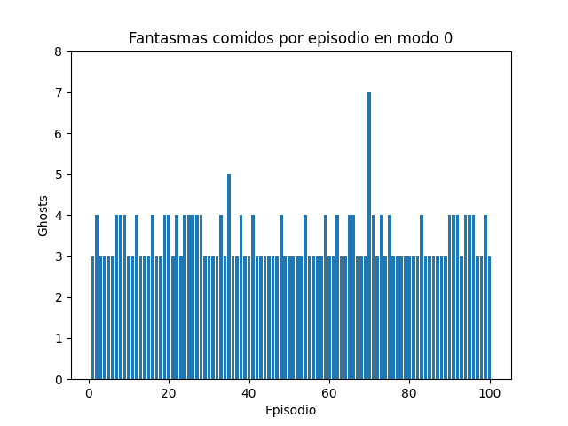
  
  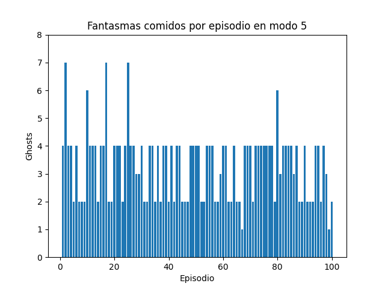

**Boxplots de métricas integradoras en 100 episodios**  

  
  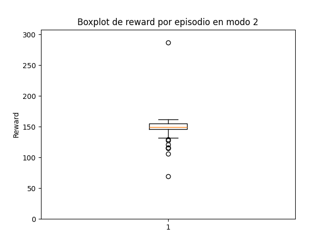
  

**Boxplots de puntos chicos ingeridos en 100 episodios**  

  
  
  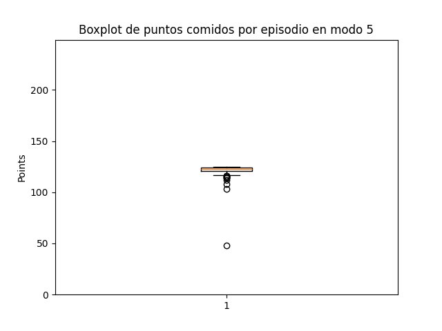

**Boxplots de pasos dados en 100 episodios**  

  
  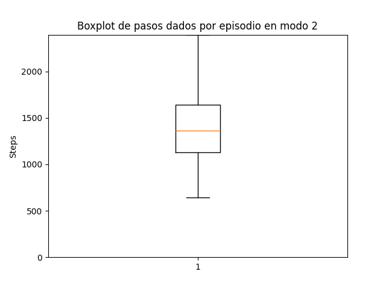
  

**Boxplots de fantasmas ingeridos en 100 episodios**  

  
  
  

  

---
## Análisis y Discusión de Resultados

## Conclusiones Finales

## Bibliografía

\[1] Farama Foundation. (s.f.). *Gymnasium documentation*. [https://gymnasium.farama.org](https://gymnasium.farama.org)

\[2] Amin, S. (2022). *Deep Q-Learning (DQN)*. Medium. [https://medium.com/@samina.amin/deep-q-learning-dqn-71c109586bae](https://medium.com/@samina.amin/deep-q-learning-dqn-71c109586bae)

\[3] Hugging Face. (s.f.). *The Deep Q-Network (DQN)*. [https://huggingface.co/learn/deep-rl-course/en/unit3/deep-q-network](https://huggingface.co/learn/deep-rl-course/en/unit3/deep-q-network)

\[4] Schaul, T., Quan, J., Antonoglou, I., & Silver, D. (2015). *Prioritized Experience Replay*. [https://arxiv.org/abs/1511.05952](https://arxiv.org/abs/1511.05952)

\[5] Hughes, C. (2023). *Understanding PPO: A Game-Changer in AI Decision-Making*. Medium. [https://medium.com/@chris.p.hughes10/understanding-ppo-a-game-changer-in-ai-decision-making-explained-for-rl-newcomers-913a0bc98d2b](https://medium.com/@chris.p.hughes10/understanding-ppo-a-game-changer-in-ai-decision-making-explained-for-rl-newcomers-913a0bc98d2b)

\[6] Papers with Code. (s.f.). *PPO Explained - Proximal Policy Optimization*. [https://paperswithcode.com/method/ppo](https://paperswithcode.com/method/ppo)

\[7] OpenAI. (s.f.). *Proximal Policy Optimization — Spinning Up*. [https://spinningup.openai.com/en/latest/algorithms/ppo.html](https://spinningup.openai.com/en/latest/algorithms/ppo.html)

\[8] Russell, S., & Norvig, P. (2010). *Artificial Intelligence: A Modern Approach* (3rd ed.). Prentice Hall.

\[9] OpenAI. (s.f.). *Proximal Policy Optimization — Spinning Up*. [https://spinningup.openai.com/en/latest/algorithms/ppo.html](https://spinningup.openai.com/en/latest/algorithms/ppo.html)

\[10] Farama Foundation. (s.f.) *Ale documentation*. [https://ale.farama.org/](https://ale.farama.org/)

\[11] Hugging Face. (s.f.). *Q-Learning*. [https://huggingface.co/learn/deep-rl-course/unit2/q-learning](https://huggingface.co/learn/deep-rl-course/unit2/q-learning)

\[12] Hugging Face. (s.f.). *Proximal Policy Optimization (PPO). [https://huggingface.co/blog/deep-rl-ppo](https://huggingface.co/blog/deep-rl-ppo)

\[13] S. Russell and P. Norvig, *Artificial Intelligence: A Modern Approach*, 3rd ed. Upper Saddle River, NJ, USA: Prentice Hall, 2010.

---
